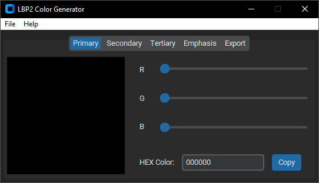

# LittleBigPlanet Popit Color Generator
A Python GUI program that generates NetCheat List files to modify LittleBigPlanet Popit Color Themes

README Document written by dermi1002

# WARNING
THIS PROGRAM IS AN UNFINISHED WORK (IN PROGRESS) AND ONLY WORKS ON LBP2 US LATEST VERSION! DO NOT ATTEMPT ON OTHER GAMES OR VERSIONS!

Doing so may result in the loss of progress in your levels, profile, or even the whole game!

Please back them up before testing/using this software.

# Using the Program
If you use Windows, you can try a Package in the [Releases Page](https://github.com/dermi1002/lbp_popit-color-generator/releases).

## Building From Source
The LittleBigPlanet Popit Color Generator was tested on Windows 10 Python 3.8.0 with CustomTkinter, PyYAML, and Pyperclip.

Although CustomTkinter is only meant to work in Windows or MacOS, a Ttk version will be made to support Linux out-of-the-box.

In order to install these libraries, create a virtual environment, and install them through this command:
```
pip install -r requirements.txt
```
Then, you can open the GUI program:
```
python main.py
```
If done correctly, you'll end up with this:



# Documents
- [How To Use](./docs/how_to_use.md)

- [How NetCheat Codes Work](./docs/netcheat_pointer_codes.md)

# To-do List
### High Priority:
- [x] Figure out what to do with the Export Tab

### Next:
- [ ] Add functionality to change colors via hex color entry and .TXT/.YAML importing
- [ ] Retheme the GUI to Tkinter's Ttk widget to remove CustomTkinter dependency and support Linux out-of-the-box
- [ ] Add Terminal logs and keyboard shortcuts

### Future Considerations:
- [ ] Create mock-up gameplay previews
- [ ] Rewrite the project in C and Lua

### Completed:
- [x] Rework the code into classes and functions for easier functionality with other games and versions (see the class-test branch)
- [x] Edit code functions, values, etc., for extra readability among project contributors
- [x] Separate functions to their own script
- [x] Add a toolbar to the program
- [x] Add top-level windows for File Export and window closing prompt
- [x] Add a new plain text Value list to deprecate .YAML support