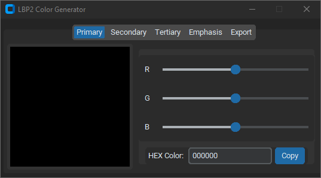
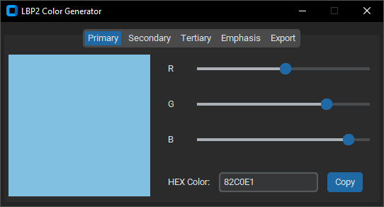
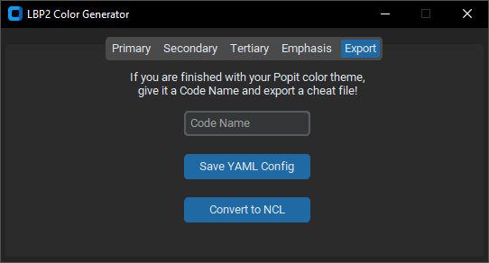
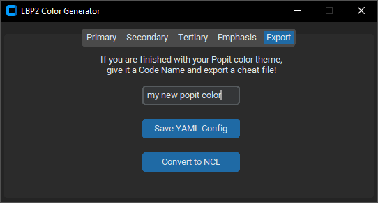

# LittleBigPlanet Popit Color Generator
A CustomTkinter GUI program that generates NetCheat List files to modify LittleBigPlanet Popit Color Themes

# THIS PROGRAM IS A WORK IN PROGRESS AND ONLY WORKS ON LBP2 US LATEST VERSION! DO NOT ATTEMPT ON OTHER GAMES OR VERSIONS!
## Doing so may result to loss of progress in your levels, profile, or even the whole game!

## How To Use
The LittleBigPlanet Popit Color Generator was tested on WIndows 10 Python 3.8.0 with CustomTkinter, PyYAML, and Pyperclip. 

In order to install these libraries, create a virtual environment, and install them through this command:
```
pip install -r requirements.txt
```
Then, you can open the GUI program:
```
python main.py
```
If done correctly, you'll end up with this:



In this window, there are five tabs, four of which are for changing color values. 

The Popit uses the first three of the values; Primary, Secondary, and Tertiary; and the fourth one, Emphasis, is used as "highlighted" text in level descriptions (and dialog bubbles (check)).

These four tabs appear in a layout like this:
- On the right are three sliders; those of which "represent" values for red, green, and blue;
- Below them is a hex color entry with a button to copy and paste outside the program; and
- On the left is a square that previews the color changed by the three sliders.



The sliders can be dragged left to right to change the square's color and the hex color entry. 

As of now, editing the hex entry won't change the color and slider values unfortunately. Functionality for this is planned in the future.

The current color value can be copied by pressing the "Copy" Button next to the entry.

Once your done editing the color values, you can move onto the fifth tab, Export:



In this tab is a label that reads:

*"If you are finished with your Popit color theme, give it a Code Name and export a cheat file!"*

Below is an entry that reads Code Name. As the label said, you can click on it and type anything into it as shown below:



After that, you can click on the "Save YAML Config" button to store your Popit color values in a YAML "configuration" file.

Then, you can click on the "Concert to NCL" button to convert a YAML file to a .ncl NetCheat List file, which is a set of values to manipulate in a PS3 memory editor.

First, the program will prompt you to open a YAML file. Then, it will prompt you to choose a directory to save the .ncl file. 

As of now, keeping the default directories is essential for the programs functionality.

Oncce you saved your .ncl file, you can import it to a memory editor for the PS3 and apply it in-game.

## How Cheat Codes Work

The NetCheat List files generated by the LittleBigPlanet Popit Color Generator use a single pointer that leads to all the addresses to the Popit Color values. 

This pointer is found via the following:
- Searching for a Popit Color value in-game through a memory editor 4-byte scan and finding a temporary address that links to it
- Searching for that temporary address as a value through a memory editor pointer scan and finding a pointer that links to it
- If done correctly, the pointer would include the Popit Color value within it.

## To-do List
### High Priority:
- [ ] Rework the code into classes and functions for easier functionality with other games and versions

### Next:
- [ ] Add functionality to change colors via hex color entry

### Future Considerations:
- [ ] ~~Complete and~~ polish README file
- [ ] Create mock-up gameplay previews

More to add...
