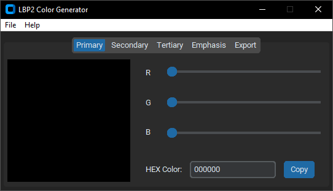

# LittleBigPlanet Popit Color Generator
A Python GUI program that generates NetCheat List files to modify LittleBigPlanet Popit Color Themes

README Document written by dermi1002

# WARNING
THIS PROGRAM IS AN UNFINISHED WORK (IN PROGRESS) AND ONLY WORKS ON LBP2 US LATEST VERSION! DO NOT ATTEMPT ON OTHER GAMES OR VERSIONS!

Doing so may result in the corruption/loss of your levels or profile!

Please back them up before testing/using the cheat codes generated by this software.

## Automated Setup Scripts
You can use an automated setup script for your platform to set up everything needed to start the program.

Do note that an Internet connection is required for part of the process to succeed. This may be changed, but is low priority and might not happen.

If all else fails, you can refer to the below section.

## Setting Up From Source
The LittleBigPlanet Popit Color Generator was tested on Windows 10 Python 3.12.0 with CustomTkinter, PyYAML, and Pyperclip.

Although CustomTkinter is only meant to work in Windows or MacOS, a Ttk version will be made to support Linux out-of-the-box.

In order to install these libraries, create a virtual environment, and install them through this command:
```
# ubuntu
pip install -r src/requirements.txt
# windows
pip install -r src\requirements.txt
```
Then, you can open the GUI program:
```
# ubuntu
python src/main.py
# windows
python src\main.py
```
If done correctly, you'll end up with this:



Further instructions on how to use the program can be found in the Documents section below.

# Documents
- [How To Use](./docs/how_to_use.md)

- [How NetCheat Codes Work](./docs/netcheat_pointer_codes.md)

# To-do List
### Current Tasks:
- [x] Create Batch and Shell Scripts for automated setup
- [x] Optimize Shell Script and check for errors
- [x] Change the README.md document accordingly

### Next:
- [ ] Refactor and organize code again
- [ ] Add Support for LBP Vita's VitaCheat Format
- [ ] Replace YAML Support with JSON and eliminate functionality for importing Value Lists
- [ ] Add Terminal logs and keyboard shortcuts
- [ ] Retheme the GUI to Tkinter's Ttk widget to remove CustomTkinter dependency and support Linux out-of-the-box

### Future Considerations:
- [ ] Create mock-up gameplay previews
- [ ] ~~Rewrite the project in C and Lua~~

### Completed:
- [x] Rework the code into classes and functions for easier functionality with other games and versions (see the class-test branch)
- [x] Edit code functions, values, etc., for extra readability among project contributors
- [x] Separate functions to their own script
- [x] Add a toolbar to the program
- [x] Add top-level windows for File Export and window closing prompt
- [x] Add a new plain text Value list to deprecate .YAML support
- [x] Figure out what to do with the Export Tab
- [x] Add functionality to change colors via hex color entry and .TXT/.YAML importing
