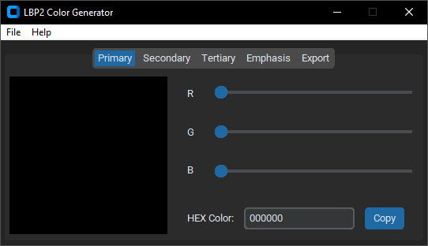

# LittleBigPlanet Popit Color Generator
A Python GUI program that generates NetCheat List files to modify LittleBigPlanet Popit Color Themes

README Document written by dermi1002

## WARNING
THIS PROGRAM IS AN UNFINISHED WORK (IN PROGRESS) AND ONLY WORKS ON LBP2 US LATEST VERSION! DO NOT ATTEMPT ON OTHER GAMES OR VERSIONS!

Doing so may result in the corruption/loss of your levels or profile!

Please back them up before testing/using the cheat codes generated by this software.

## Python Installation

This project uses Python to provide a GUI and export cheat codes. To run it, you must install Python for your system. The minimum version required is 3.7 at the least.

### Windows:

Look for installers of version 3.12 or version 3.13. During installation, make sure that you have Pip, Virtual Environment, and Tkinter, and perhaps PATH checked.

### Linux:

Some Distros may not have Python's Virtual Environment and Tkinter packages included in their installation. To check whether or not they're installed, list their package names in a package manager and check if they're marked as installed.

Example:
```
# Ubuntu
apt list python3-tk python3-venv
```
Any package that isn't marked as installed must be installed for the program to work.

Example:
```
# Ubuntu
sudo apt install python3-tk python3-venv
```

## Automated Setup Scripts
You can use an automated setup script for your platform to set up everything needed to start the program. However, an Internet connection is required for Pip package installation. This may be changed, but is low priority and might not happen.

If all else fails (or you're using MacOS), you can refer to the below section.

## Setting Up From Source
The LittleBigPlanet Popit Color Generator was tested on Python 3.12 (Windows 10/11) and Python 3.13 (Lubuntu 24.04) with CustomTkinter, PyYAML, and Pyperclip.

Although CustomTkinter is only meant to work in Windows or MacOS, a Ttk version will be made to support Linux out-of-the-box.

In order to install these libraries, create a virtual environment and activate it, and install them through this command:
```
# Ubuntu
pip install -r src/requirements.txt
# Windows
pip install -r src\requirements.txt
```
Then, you can open the GUI program:
```
# Ubuntu
python src/main.py
# Windows
python src\main.py
```
If done correctly, you'll end up with this:



Further instructions on how to use the program can be found in the Documents section below.

# Documents
- [How To Use](./docs/how_to_use.md)

- [How NetCheat Codes Work](./docs/netcheat_pointer_codes.md)

# To-do List
### Current Tasks:

- [x] Create a Changelog Document
    - [ ] Document changes for each version
        - [ ] 0.1.0
        - [ ] 0.1.1
        - [ ] 0.2.0
        - [ ] 0.3.0
        - [ ] 0.4.0
        - [ ] 0.5.0 (based on this branch)

- [x] Create a Coding Style/Contribution Document
    - [ ] Format the document for more in-depth details

### Next:
- [ ] Add Support for LBP1 Cheat Codes and LBP Vita's VitaCheat Format
- [ ] ~~Replace YAML Support with JSON~~ and eliminate functionality for importing Value Lists
- [ ] Add Terminal logs and keyboard shortcuts
- [ ] Replace the Setup Scripts with a Python one
- [ ] Retheme the GUI to Tkinter's Ttk widget to remove CustomTkinter dependency and support Linux out-of-the-box

### Future Considerations:
- [ ] Create mock-up gameplay previews
- [ ] ~~Rewrite the project in C and Lua~~

# Change Log

Changes to the repository are documented in the [Change Log](.github/CHANGELOG.md).