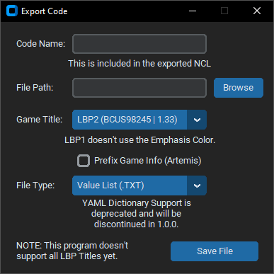

# How To Use 
When you open the program, there will be five tabs, four of which are for changing color values. 

The Popit uses the first three of the values; Primary, Secondary, and Tertiary; and the fourth one, Emphasis, is used as "highlighted" text in level descriptions.

These four tabs appear in a layout like this:
- On the right are three sliders; those of which "represent" values for red, green, and blue;
- Below them is a hex color entry with a button to copy and paste outside the program; and
- On the left is a square that previews the color changed by the three sliders.

The sliders can be dragged right and left to change the square's color and the hex color entry. 

As of now, editing the hex entry won't change the color and slider values, unfortunately. Functionality for this is planned in the future.

The current color value can be copied by clicking the "Copy" Button next to the entry.

Once your done editing the color values, you can move onto the fifth tab, Export:

In this tab is an entry for the NetCheat Code Name. You can click on it and type anything into it as shown below:

After that, below is a Game Title option, where you can set the mainline title of your target. Choices for this are:
- LittleBigPlanet 2, which is fully supported by the program,
- LittleBigPlanet 1, which stores color values differently and the program adapts accordingly, and isn't fully supported yet, and
- LittleBigPlanet 3, which stores color values the same as LBP2 but isn't fully supported yet.

Then, you have three choices. You can:
- click on the "Save NCL" button to store your Popit color values in a .ncl NetCheat List file, which is important for getting the custom Popit color in your LittleBigPlanet game;
- click on the "Save Value List" button to store your Popit color values in a text file, which is not yet, but planned to be, openable by the program; and/or
- click on the "Save YAML (Old)" button to store your Popit color values in a YAML dictionary file. Support for this format is deprecated and will be discontinued in later releases.

When you click on either of these, you'll be met with a window prompting you to choose a location to save your file in.

As of now, the amount of available choices varies depending on the Game Title you choose; and perhaps keeping the default directories is essential for the programs functionality.

Once you saved your .ncl file, you can import it to the PS3 memory editor of your choice and apply it once your game is loaded and your Sackperson is in their Pod or in a level.

## Toolbar

The thing between the window title with the close button and the program itself is a toolbar with two tabs:
- File, which gives you the ability to open another window of exporting options, but can't open files yet, and
- Help, which does nothing, ironically.

When you click "Save Code" in the File tab, you'll be met with this:

It serves the same purpose as the Export tab in the main program, but functions slightly differently.

First, there's a file path entry, where you can either manually input an entire location to a directory, or click the "Browse" button, which will prompt you to choose a location, then input that for you.

Second, there's a checkbox for prefixing game info. This feature is to add convenience for finding the cheat code in Artemis after importing it to the "codebase" directory.

Third, there's a file type option which lists the three available color value formats to export in.

Last, there's a "Save File" button, which won't prompt you to choose a location to save in, but rather saves the file according to everything you entered/chose in an instant.
